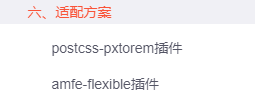

# vue3-blog帮助文档

### tsParticles安装
```ts
pnpm install @tsparticles/vue3
pnpm install @tsparticles/slim
```

vite.config.ts中添加
```ts
import Particles from "@tsparticles/vue3";
import { loadSlim } from "@tsparticles/slim"; 

createApp(App).use(Particles, {
  init: async engine => {
    await loadSlim(engine); // or you can load the slim version from "@tsparticles/slim" if don't need Shapes or Animations
  },
});
```

在App.vue页面中使用
```html
<!--
 * @Description: 
 * @Autor: Southern Wind
 * @Date: 2024-01-19 10:02:23
 * @LastEditors: Southern Wind
 * @LastEditTime: 2024-01-19 11:31:47
-->
<script setup lang="ts">
// <!--引入粒子特效的相关配置-->
const options = {
  background: {
    color: {
      
    },
   
    position: "	50% 50%",
    repeat: "	no-repeat",
    size: "cover",
    opacity: 1,
  },
  fpsLimit: 60,
  interactivity: {
    events: {
      onClick: {
        enable: true,
        mode: "push", //可用的click模式有: "push", "remove", "repulse", "bubble"。
      },
      onHover: {
        enable: true,
        mode: "grab", //可用的hover模式有: "grab", "repulse", "bubble"。
      },
      resize: true,
    },
    modes: {
      bubble: {
        distance: 400,
        duration: 2,
        opacity: 0.8,
        size: 40,
      },
      push: {
        quantity: 4,
      },
      repulse: {
        distance: 200,
        duration: 0.4,
      },
    },
  },
  particles: {
    color: {
      value: "#ffffff",
    },
    links: {
      color: "#ffffff", //'#dedede'。线条颜色。
      distance: 150, //线条长度
      enable: true, //是否有线条
      opacity: 0.5, //线条透明度。
      width: 1, //线条宽度。
    },
    collisions: {
      enable: false,
    },
    move: {
      direction: "none",
      enable: true,
      outMode: "bounce",
      random: false,
      speed: 4, //粒子运动速度。
      straight: false,
    },
    number: {
      density: {
        enable: true,
        area: 800,
      },
      value: 80, //粒子数量。
    },
    opacity: {
      value: 0.5, //粒子透明度。
    },
    shape: {
      type: "circle", //可用的粒子外观类型有："circle","edge","triangle", "polygon","star"
    },
    size: {
      random: true,
      value: 5,
    },
  },
  detectRetina: true,
};

const particlesLoaded = async (container) => {
  console.log("Particles container loaded", container);
};
</script>

<template>
  <!-- <vue-particles id="tsparticles" :particlesLoaded="particlesLoaded" url="http://foo.bar/particles.json" /> -->
 <div class="box">
  <vue-particles id="tsparticles" :particlesLoaded="particlesLoaded" :options="options" />
 </div>

</template>

<style scoped>
.box{
  background-image: url(./assets/01.jpg); // 背景图
  width: 100%;
  height: 100vh;
  background-size: cover;
  background-repeat: no-repeat;

}
</style>

```
效果：


## 关于打字机

```ts
pnpm install typed.js
```

#### 全局引入
```ts
import vuetyped from 'vue3typed'
createApp(App).use(vuetyped).mount('#app')
```
#### 使用
```html
    <vuetyped :strings="['Hi', 'This is Southern Wind blog', 'Welcome to visit']" :loop="true" :startDelay="300" :typeSpeed="100" :backSpeed="50" :smart-backspace="true">
      <div class="typing" />
    </vuetyped>
```
#### 特性
<table>
<thead>
<tr>
<th>Property</th>
<th>Type</th>
<th>Description</th>
<th>Usage</th>
</tr>
</thead>
<tbody>
<tr>
<td>strings</td>
<td>Array</td>
<td>strings to be typed</td>
<td><code>:strings="['Text 1', 'Text 2']"</code></td>
</tr>
<tr>
<td>stringsElement</td>
<td>String</td>
<td>ID of element containing string children</td>
<td><code>:stringsElement="'myId'"</code></td>
</tr>
<tr>
<td>typeSpeed</td>
<td>Number</td>
<td>type speed in milliseconds</td>
<td><code>:typeSpeed="50"</code></td>
</tr>
<tr>
<td>startDelay</td>
<td>Number</td>
<td>time before typing starts in milliseconds</td>
<td><code>:startDelay="1000"</code></td>
</tr>
<tr>
<td>backSpeed</td>
<td>Number</td>
<td>backspacing speed in milliseconds</td>
<td><code>:backSpeed="10"</code></td>
</tr>
<tr>
<td>smartBackspace</td>
<td>Boolean</td>
<td>only backspace what doesn't match the previous string</td>
<td><code>:smartBackspace="true"</code></td>
</tr>
<tr>
<td>shuffle</td>
<td>Boolean</td>
<td>shuffle the strings</td>
<td><code>:shuffle="true"</code></td>
</tr>
<tr>
<td>backDelay</td>
<td>Number</td>
<td>time before backspacing in milliseconds</td>
<td><code>:backDelay="100"</code></td>
</tr>
<tr>
<td>fadeOut</td>
<td>Boolean</td>
<td>Fade out instead of backspace</td>
<td><code>:fadeOut="true"</code></td>
</tr>
<tr>
<td>fadeOutClass</td>
<td>String</td>
<td>css class for fade animation</td>
<td><code>:fadeOutClass="'fadeOutClass'"</code></td>
</tr>
<tr>
<td>fadeOutDelay</td>
<td>Number</td>
<td>fade out delay in milliseconds</td>
<td><code>:fadeOutDelay="500"</code></td>
</tr>
<tr>
<td>loop</td>
<td>Boolean</td>
<td>loop strings</td>
<td><code>:loop="true"</code></td>
</tr>
<tr>
<td>loopCount</td>
<td>Number</td>
<td>amount of loops</td>
<td><code>:loopCount="3"</code></td>
</tr>
<tr>
<td>showCursor</td>
<td>Boolean</td>
<td>show cursor</td>
<td><code>:showCursor="true"</code></td>
</tr>
<tr>
<td>cursorChar</td>
<td>String</td>
<td>character for cursor</td>
<td><code>:cursorChar="'_'"</code></td>
</tr>
<tr>
<td>autoInsertCss</td>
<td>Boolean</td>
<td>insert CSS for cursor and fadeOut into HTML</td>
<td><code>:autoInsertCss="true"</code></td>
</tr>
<tr>
<td>attr</td>
<td>String</td>
<td>attribute for typing Ex: input placeholder, value, or just HTML text</td>
<td><code>:attr="'placeholder'"</code></td>
</tr>
<tr>
<td>bindInputFocusEvents</td>
<td>Boolean</td>
<td>bind to focus and blur if el is text input</td>
<td><code>:bindInputFocusEvents="true"</code></td>
</tr>
<tr>
<td>contentType</td>
<td>String</td>
<td>'html' or 'null' for plaintext</td>
<td><code>:contentType="'html'"</code></td>
</tr>
</tbody>
</table>

#### 事件
<table>
<thead>
<tr>
<th>Event</th>
<th>Description</th>
<th>Usage</th>
</tr>
</thead>
<tbody>
<tr>
<td>onComplete</td>
<td>All typing is complete</td>
<td><code>@onComplete="doSmth()"</code></td>
</tr>
<tr>
<td>preStringTyped</td>
<td>Before each string is typed</td>
<td><code>@preStringTyped="doSmth()"</code></td>
</tr>
<tr>
<td>onStringTyped</td>
<td>After each string is typed</td>
<td><code>@onStringTyped="doSmth()"</code></td>
</tr>
<tr>
<td>onLastStringBackspaced</td>
<td>During looping, after last string is typed</td>
<td><code>@onLastStringBackspaced="doSmth()"</code></td>
</tr>
<tr>
<td>onTypingPaused</td>
<td>Typing has been stopped</td>
<td><code>@onTypingPaused="doSmth()"</code></td>
</tr>
<tr>
<td>onTypingResumed</td>
<td>Typing has been started after being stopped</td>
<td><code>@onTypingResumed="doSmth()"</code></td>
</tr>
<tr>
<td>onReset</td>
<td>After reset</td>
<td><code>@onReset="doSmth()"</code></td>
</tr>
<tr>
<td>onStop</td>
<td>After stop</td>
<td><code>@onStop="doSmth()"</code></td>
</tr>
<tr>
<td>onStart</td>
<td>After start</td>
<td><code>@onStart="doSmth()"</code></td>
</tr>
<tr>
<td>onDestroy</td>
<td>After destroy</td>
<td><code>@onDestroy="doSmth()"</code></td>
</tr>
</tbody>
</table>

**注意！！ 如果在部署时报以下错误(如没有可以直接跳过)**
```ts
src/main.ts(15,22): error TS7016: Could not find a declaration file for module 'vue3typed'. 'D:/Ademo/vite-southern-wind-blog/node_modules/.pnpm/vue3typed@0.1.5_typescript@5.3.3/node_modules/vue3typed/libs/index.js' implicitly has an 'any' type.
  Try `npm i --save-dev @types/vue3typed` if it exists or add a new declaration (.d.ts) file containing `declare module 'vue3typed';`

```
那么在src目录下新建`types/index.d.ts`
```ts
declare module "vue3typed";
```


## 移动端自适应
可以拉到最下方查找
[Vue3+TS+Vant3+Pinia(H5端)配置教程](http://t.csdnimg.cn/B8t6Q)


因为主适配网站为pc，所以可以用下方的模板替换到`vite.config.ts`中
```ts
 // 适配
 css: {
    postcss: {
      plugins: [
        postcssImport({
          // 这里的rootValue就是你的设计稿大小
          rootValue({ file }) {
            return file.indexOf('vant') !== -1 ? 37.5 : 192;
          },
          propList: ['*'],
        })
      ]
    }
  }
```